```R
install.packages('rtools')
install.packages('openxlsx')
install.packages('ggplot2')
install.packages('data.table')
install.packages('skimr')
install.packages('GGally')
install.packages('ggcorrplot')
install.packages('forecast')
install.packages('readxl')

```

#Installing related libraries.

```R
require(data.table)
require(lubridate)
require(forecast)
require(skimr)
require(repr)
require(readxl)
require(fable)

options(repr.plot.width=12.7, repr.plot.height=8.5)

#data_path=file.choose()

data=read_excel("C:/Users/DELL/Desktop/HW1/EVDS_whole_data.xlsx")
head(data,49)
str(data)

```

    


<table class="dataframe">
<caption>A tibble: 48 × 5</caption>
<thead>
	<tr><th scope=col>Date</th><th scope=col>sales_of_first_hand_houses</th><th scope=col>banknote_amount</th><th scope=col>total_reserves</th><th scope=col>traktor</th></tr>
	<tr><th scope=col>&lt;chr&gt;</th><th scope=col>&lt;dbl&gt;</th><th scope=col>&lt;dbl&gt;</th><th scope=col>&lt;dbl&gt;</th><th scope=col>&lt;dbl&gt;</th></tr>
</thead>
<tbody>
	<tr><td>2020-01</td><td>21251</td><td> 247535062</td><td>141668.2</td><td>2515</td></tr>
	<tr><td>2020-02</td><td>22662</td><td> 257142979</td><td>143026.5</td><td>2750</td></tr>
	<tr><td>2020-03</td><td>19846</td><td> 285383761</td><td>127037.8</td><td>2188</td></tr>
	<tr><td>2020-04</td><td> 6113</td><td> 346870189</td><td>122838.3</td><td> 997</td></tr>
	<tr><td>2020-05</td><td> 7640</td><td> 356955085</td><td>127902.3</td><td>1900</td></tr>
	<tr><td>2020-06</td><td>28799</td><td> 354005691</td><td>126314.8</td><td>3172</td></tr>
	<tr><td>2020-07</td><td>39432</td><td> 391068065</td><td>129320.0</td><td>3313</td></tr>
	<tr><td>2020-08</td><td>30292</td><td> 353691164</td><td>124714.6</td><td>2968</td></tr>
	<tr><td>2020-09</td><td>25399</td><td> 349475664</td><td>118358.2</td><td>4133</td></tr>
	<tr><td>2020-10</td><td>22270</td><td> 357023592</td><td>120421.3</td><td>4575</td></tr>
	<tr><td>2020-11</td><td>21158</td><td> 323189064</td><td>119935.2</td><td>4609</td></tr>
	<tr><td>2020-12</td><td>20236</td><td> 315102176</td><td>128024.8</td><td>4983</td></tr>
	<tr><td>2021-01</td><td>13666</td><td> 306527685</td><td>137187.7</td><td>4414</td></tr>
	<tr><td>2021-02</td><td>15929</td><td> 303573135</td><td>135949.7</td><td>4900</td></tr>
	<tr><td>2021-03</td><td>22007</td><td> 332350843</td><td>132342.8</td><td>5761</td></tr>
	<tr><td>2021-04</td><td>19260</td><td> 353046912</td><td>132011.3</td><td>4597</td></tr>
	<tr><td>2021-05</td><td>11356</td><td> 373079969</td><td>136900.3</td><td>4400</td></tr>
	<tr><td>2021-06</td><td>25833</td><td> 380173239</td><td>141697.0</td><td>5676</td></tr>
	<tr><td>2021-07</td><td>18884</td><td> 393642283</td><td>149257.4</td><td>3502</td></tr>
	<tr><td>2021-08</td><td>24286</td><td> 382791917</td><td>161059.3</td><td>3041</td></tr>
	<tr><td>2021-09</td><td>28229</td><td> 404963541</td><td>164205.4</td><td>4919</td></tr>
	<tr><td>2021-10</td><td>26041</td><td> 448091495</td><td>166892.0</td><td>4610</td></tr>
	<tr><td>2021-11</td><td>31706</td><td> 486567384</td><td>167608.7</td><td>5056</td></tr>
	<tr><td>2021-12</td><td>39026</td><td> 474580684</td><td>156686.4</td><td>4627</td></tr>
	<tr><td>2022-01</td><td>15110</td><td> 481096389</td><td>153016.1</td><td>3594</td></tr>
	<tr><td>2022-02</td><td>18752</td><td> 497265084</td><td>154199.0</td><td>4314</td></tr>
	<tr><td>2022-03</td><td>23974</td><td> 536988900</td><td>152092.8</td><td>4768</td></tr>
	<tr><td>2022-04</td><td>26330</td><td> 638516567</td><td>150046.4</td><td>4038</td></tr>
	<tr><td>2022-05</td><td>22148</td><td> 607139509</td><td>146596.8</td><td>3486</td></tr>
	<tr><td>2022-06</td><td>27998</td><td> 679146649</td><td>143472.2</td><td>4480</td></tr>
	<tr><td>2022-07</td><td>14350</td><td> 759833311</td><td>147389.4</td><td>2630</td></tr>
	<tr><td>2022-08</td><td>18485</td><td> 803252845</td><td>155357.2</td><td>2812</td></tr>
	<tr><td>2022-09</td><td>19089</td><td> 841239443</td><td>153001.4</td><td>4786</td></tr>
	<tr><td>2022-10</td><td>16987</td><td> 884125726</td><td>158935.4</td><td>4810</td></tr>
	<tr><td>2022-11</td><td>19687</td><td> 915396164</td><td>163684.3</td><td>5221</td></tr>
	<tr><td>2022-12</td><td>36744</td><td> 966978002</td><td>166411.7</td><td>4602</td></tr>
	<tr><td>2023-01</td><td>17415</td><td> 971710803</td><td>165193.2</td><td>4893</td></tr>
	<tr><td>2023-02</td><td>14980</td><td>1004257875</td><td>157106.5</td><td>5042</td></tr>
	<tr><td>2023-03</td><td>18166</td><td>1077269899</td><td>161194.3</td><td>5972</td></tr>
	<tr><td>2023-04</td><td>13944</td><td>1199594983</td><td>153924.8</td><td>4690</td></tr>
	<tr><td>2023-05</td><td>18435</td><td>1179833064</td><td>139231.3</td><td>5143</td></tr>
	<tr><td>2023-06</td><td>13578</td><td>1598802579</td><td>152403.7</td><td>4311</td></tr>
	<tr><td>2023-07</td><td>15724</td><td>1384060588</td><td>154762.4</td><td>5015</td></tr>
	<tr><td>2023-08</td><td>17408</td><td>1429845627</td><td>159674.7</td><td>3222</td></tr>
	<tr><td>2023-09</td><td>15247</td><td>1501057194</td><td>161428.7</td><td>5177</td></tr>
	<tr><td>2023-10</td><td>14941</td><td>1502964678</td><td>164907.3</td><td>4944</td></tr>
	<tr><td>2023-11</td><td>15187</td><td>1541774649</td><td>176087.3</td><td>4816</td></tr>
	<tr><td>2023-12</td><td>23714</td><td>1561387090</td><td>180659.2</td><td>4345</td></tr>
</tbody>
</table>


    tibble [48 × 5] (S3: tbl_df/tbl/data.frame)
     $ Date                      : chr [1:48] "2020-01" "2020-02" "2020-03" "2020-04" ...
     $ sales_of_first_hand_houses: num [1:48] 21251 22662 19846 6113 7640 ...
     $ banknote_amount           : num [1:48] 2.48e+08 2.57e+08 2.85e+08 3.47e+08 3.57e+08 ...
     $ total_reserves            : num [1:48] 141668 143027 127038 122838 127902 ...
     $ traktor                   : num [1:48] 2515 2750 2188 997 1900 ...
    

#In order to check if data are correlated, I checked the graph first for intuition and then I choose from those 4 according to their correlation. 
```R

require(ggplot2)
ggplot(data , aes(x = Date, y= sales_of_first_hand_houses, group =1)) + geom_line(color ="black", linewidth = 1.5)
ggplot(data , aes(x = Date, y= banknote_amount, group =1)) + geom_line(color ="blue", linewidth = 1.5)
ggplot(data , aes(x = Date, y= traktor, group =1  )) + geom_line(color ="purple", linewidth = 1.5)
ggplot(data , aes(x = Date, y= total_reserves, group =1  )) + geom_line(color ="red", linewidth = 1.5)


```


    

    


    
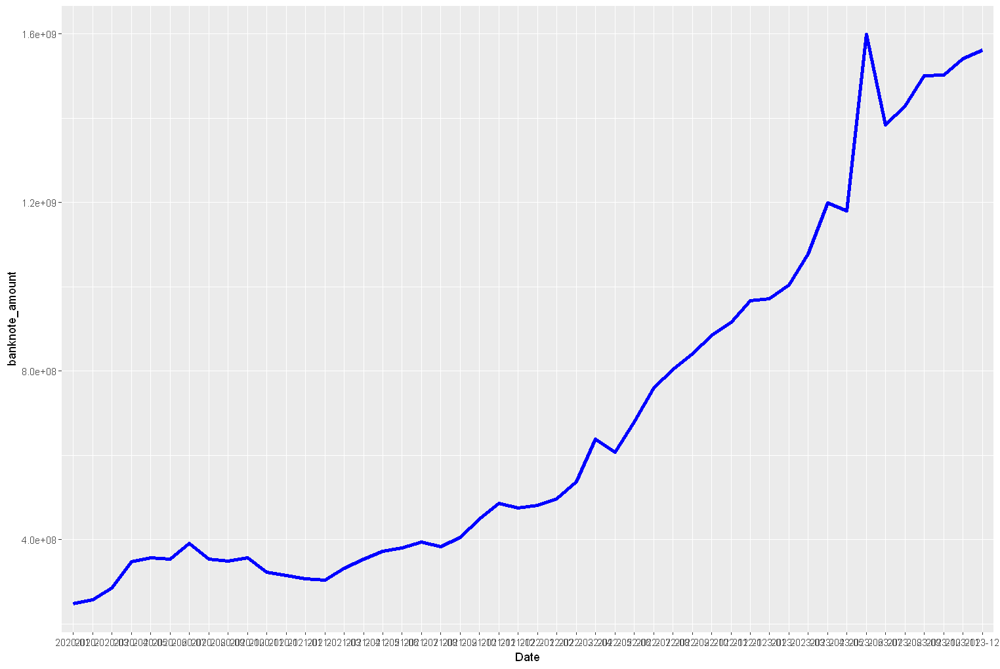
    


    
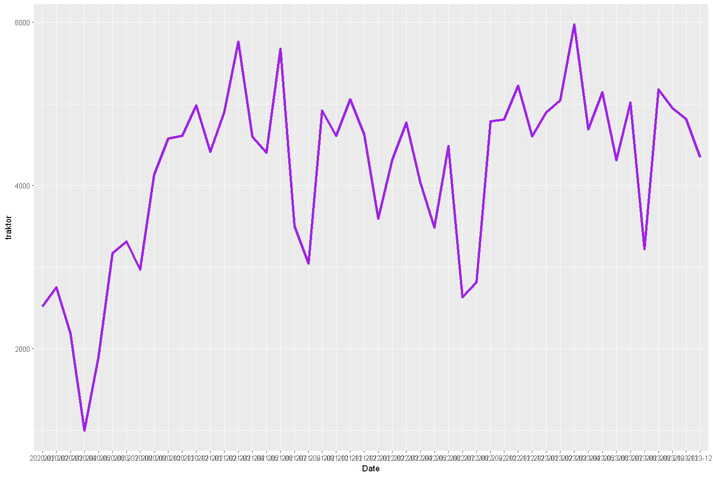
    


    
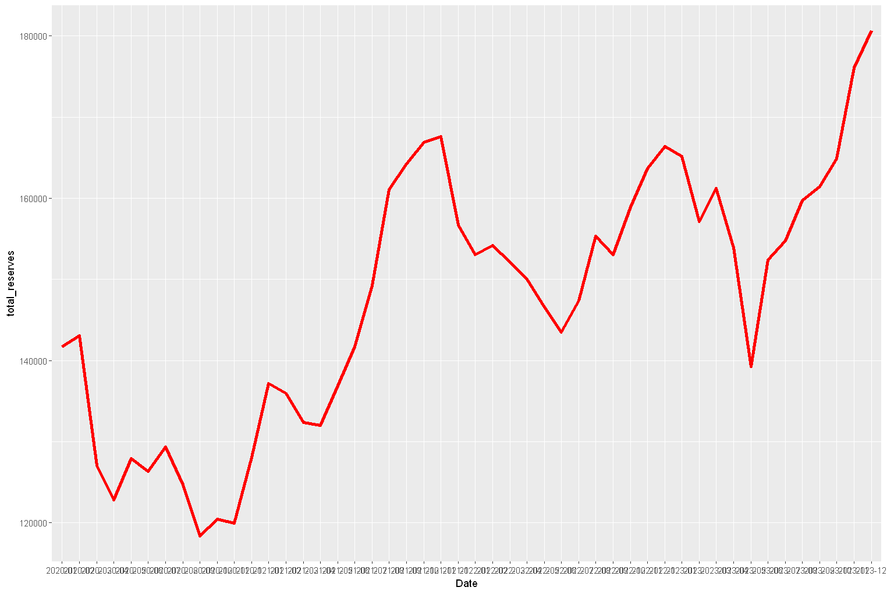
    


```R

require(GGally)
ggpairs(data,cardinality_threshold=NULL)

```

    `stat_bin()` using `bins = 30`. Pick better value with `binwidth`.
    `stat_bin()` using `bins = 30`. Pick better value with `binwidth`.
    `stat_bin()` using `bins = 30`. Pick better value with `binwidth`.
    `stat_bin()` using `bins = 30`. Pick better value with `binwidth`.
    


    
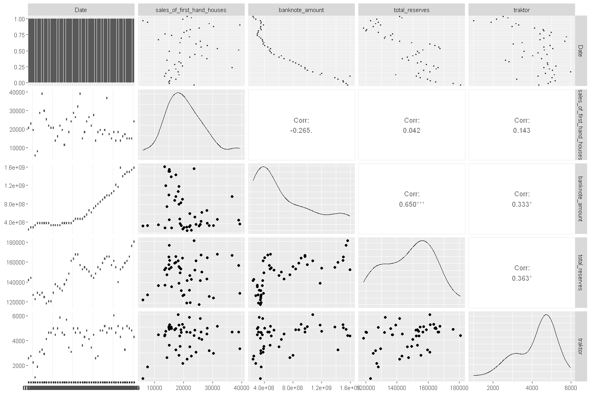
    


```R
data1 <- data.table()
data1[,'Date':= data[,'Date']]
data1[,'istanbul_first_hand_houses':= data[,'sales_of_first_hand_houses']]

start_month <- "2020-01"
end_month <- "2023-12"

x1 <- fread('C:/Users/DELL/Desktop/HW1/faiz_artırımı.csv')
x1[, Month := format(Hafta, "%Y-%m")]
x1 <- x1[, .(Sum = sum(`faiz artırımı: (Türkiye)`)), by = Month]
x1 <- x1[Month %between% c(start_month, end_month)]

x2 <- fread('C:/Users/DELL/Desktop/HW1/satılık_daire.csv')
x2[, Month := format(Hafta, "%Y-%m")]
x2 <- x2[, .(Sum = sum(`istanbul satılık daire: (Türkiye)`)), by = Month]
x2 <- x2[Month %between% c(start_month, end_month)]

x3 <- fread('C:/Users/DELL/Desktop/HW1/sıfır_satılık_daire.csv')
x3[, Month := format(Hafta, "%Y-%m")]
x3 <- x3[, .(Sum = sum(`istanbul sıfır satılık daire: (Türkiye)`)), by = Month]
x3 <- x3[Month %between% c(start_month, end_month)]

x4 <- fread('C:/Users/DELL/Desktop/HW1/sahibinden_istanbul_house_sales.csv')
x4[, Month := format(Hafta, "%Y-%m")]
x4 <- x4[, .(Sum = sum(`sahibinden istanbul ev: (Türkiye)`)), by = Month]
x4 <- x4[Month %between% c(start_month, end_month)]

data1[,'faiz_artırımı':= x1[,'Sum']]
data1[,'istanbul_satılık_daire':= x2[,'Sum']]
data1[,'istanbul_sıfır_satılık_daire':= x3[,'Sum']]
data1[,'sahibinden_istanbul_satılık_daire':= x4[,'Sum']]
data1$t <- 1:nrow(data)

head(data1)
```


<table class="dataframe">
<caption>A data.table: 6 × 7</caption>
<thead>
	<tr><th scope=col>Date</th><th scope=col>istanbul_first_hand_houses</th><th scope=col>faiz_artırımı</th><th scope=col>istanbul_satılık_daire</th><th scope=col>istanbul_sıfır_satılık_daire</th><th scope=col>sahibinden_istanbul_satılık_daire</th><th scope=col>t</th></tr>
	<tr><th scope=col>&lt;chr&gt;</th><th scope=col>&lt;dbl&gt;</th><th scope=col>&lt;int&gt;</th><th scope=col>&lt;int&gt;</th><th scope=col>&lt;int&gt;</th><th scope=col>&lt;int&gt;</th><th scope=col>&lt;int&gt;</th></tr>
</thead>
<tbody>
	<tr><td>2020-01</td><td>21251</td><td>2</td><td>147</td><td>  0</td><td>218</td><td>1</td></tr>
	<tr><td>2020-02</td><td>22662</td><td>2</td><td>142</td><td> 55</td><td>173</td><td>2</td></tr>
	<tr><td>2020-03</td><td>19846</td><td>1</td><td>133</td><td>  0</td><td>157</td><td>3</td></tr>
	<tr><td>2020-04</td><td> 6113</td><td>0</td><td>116</td><td>  0</td><td>136</td><td>4</td></tr>
	<tr><td>2020-05</td><td> 7640</td><td>2</td><td>234</td><td>152</td><td>309</td><td>5</td></tr>
	<tr><td>2020-06</td><td>28799</td><td>0</td><td>268</td><td>231</td><td>272</td><td>6</td></tr>
</tbody>
</table>


```R
ggplot(data1, aes(x = Date, y= istanbul_first_hand_houses, group =1)) + geom_line(color ="black", linewidth = 1.5) +geom_point()
ggplot(data1 , aes(x = Date, y= faiz_artırımı, group =1)) + geom_line(color ="blue", linewidth = 1.5)
ggplot(data1 , aes(x = Date, y= istanbul_satılık_daire, group =1  )) + geom_line(color ="purple", linewidth = 1.5)
ggplot(data1 , aes(x = Date, y= istanbul_sıfır_satılık_daire, group =1  )) + geom_line(color ="red", linewidth = 1.5)
ggplot(data1 , aes(x = Date, y= sahibinden_istanbul_satılık_daire, group =1  )) + geom_line(color ="green", linewidth = 1.5)

```

#From graphs, I do see a similar behaviours, so will check their correlation pairwise.
    
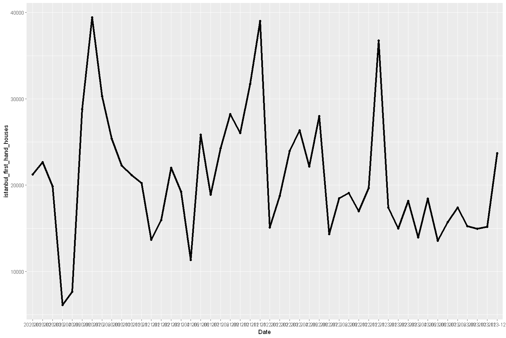
    


    
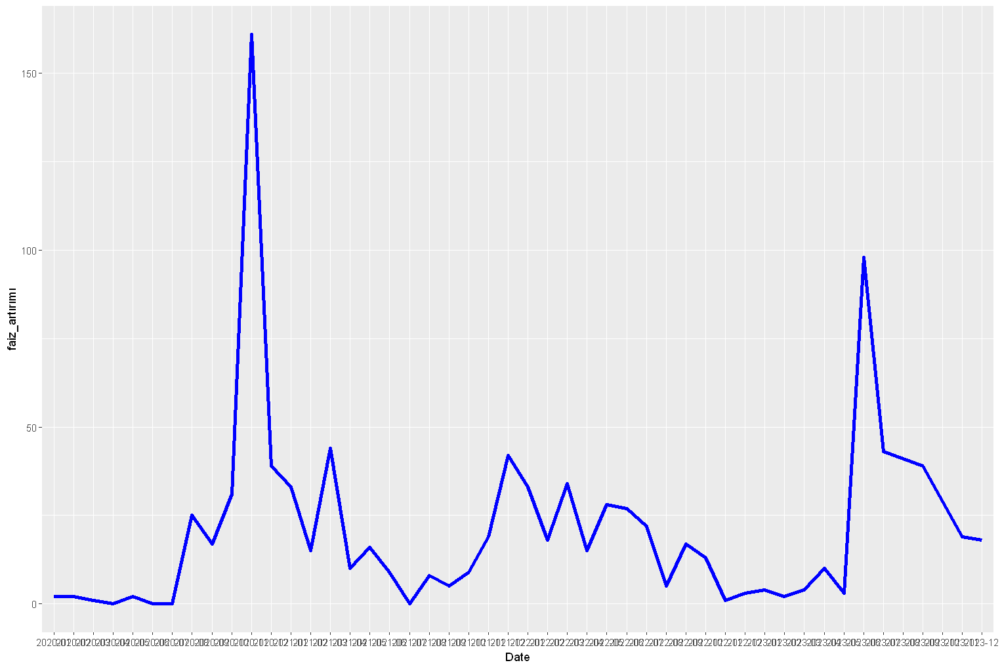
    


    
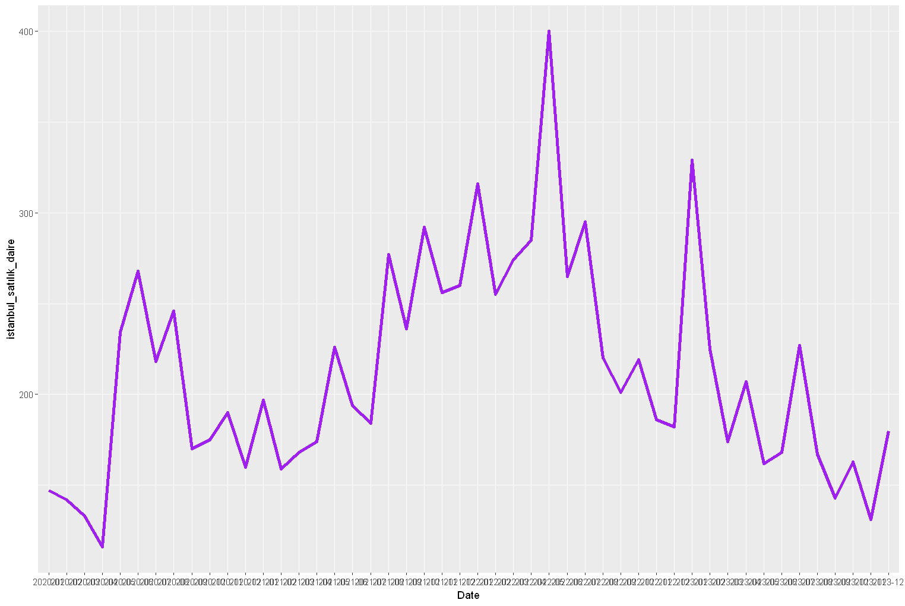
    


    
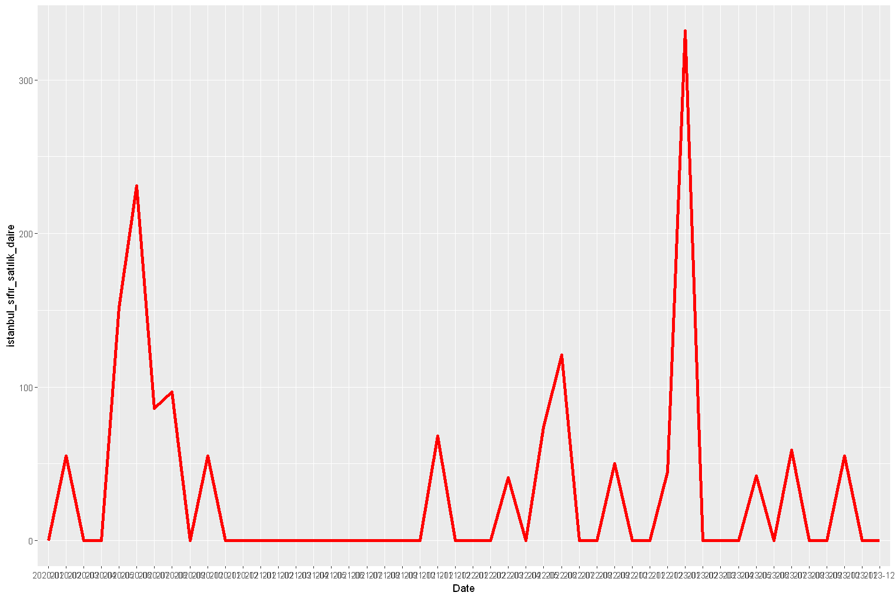
    


    
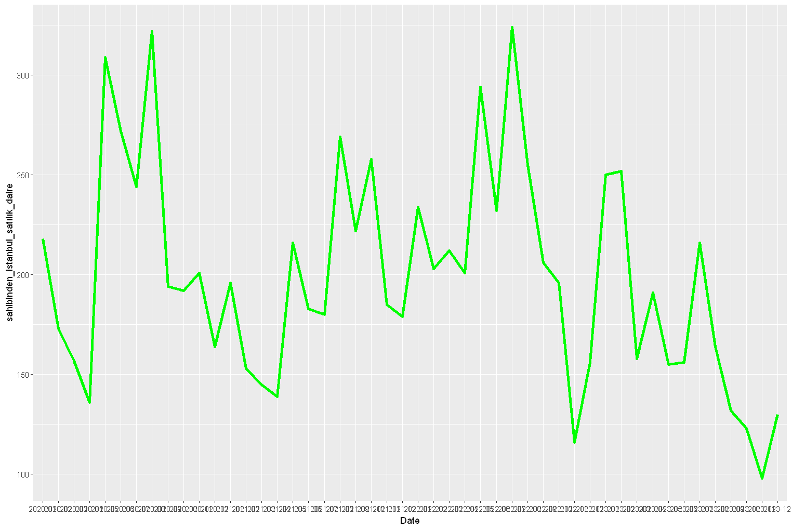
    


```R
require(GGally)
ggpairs(data1,cardinality_threshold=NULL)

```
#İstanbul_satılık_daire has the most correlation, so I will try to leverage that.Also it makes sense the overall effects. Also I do see some kind of similarity between faiz_artırımı and istanbul_satılık_daire but there seems to be a some kind of lags. Before that I will check autocorrelation.


    
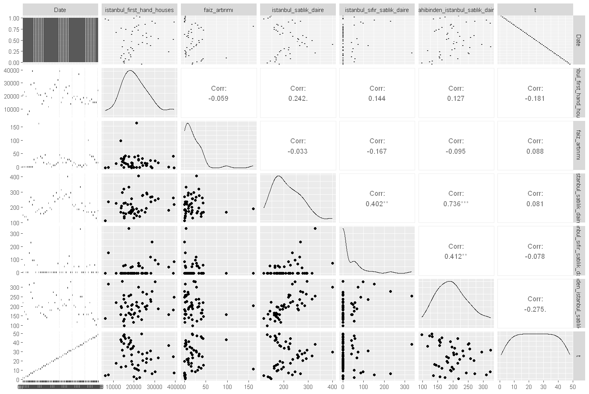
    


```R
acf(data1[,'istanbul_first_hand_houses'])
```


    
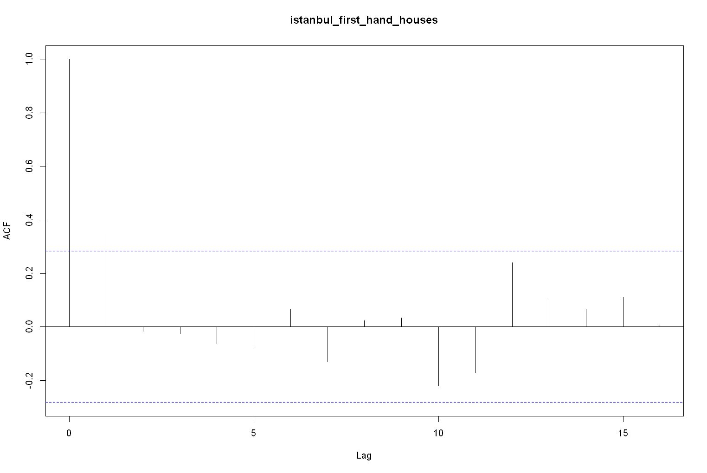
    


```R
model1 <- lm(istanbul_first_hand_houses ~ t + faiz_artırımı + istanbul_satılık_daire + istanbul_sıfır_satılık_daire + sahibinden_istanbul_satılık_daire, data = data1)
summary(model1)
```


    
    Call:
    lm(formula = istanbul_first_hand_houses ~ t + faiz_artırımı + 
        istanbul_satılık_daire + istanbul_sıfır_satılık_daire + 
        sahibinden_istanbul_satılık_daire, data = data1)
    
    Residuals:
         Min       1Q   Median       3Q      Max 
    -15080.0  -3148.0    175.9   2306.8  17308.4 
    
    Coefficients:
                                       Estimate Std. Error t value Pr(>|t|)    
    (Intercept)                       21161.041   5093.953   4.154 0.000157 ***
    t                                  -160.249     84.450  -1.898 0.064643 .  
    faiz_artırımı                       -10.485     37.930  -0.276 0.783581    
    istanbul_satılık_daire               61.710     28.772   2.145 0.037795 *  
    istanbul_sıfır_satılık_daire          6.286     17.724   0.355 0.724629    
    sahibinden_istanbul_satılık_daire   -47.687     32.432  -1.470 0.148909    
    ---
    Signif. codes:  0 '***' 0.001 '**' 0.01 '*' 0.05 '.' 0.1 ' ' 1
    
    Residual standard error: 7007 on 42 degrees of freedom
    Multiple R-squared:  0.1447,	Adjusted R-squared:  0.04289 
    F-statistic: 1.421 on 5 and 42 DF,  p-value: 0.2365
    


```R
data1[, possible_lag := shift(istanbul_first_hand_houses, n = 2)]
data1.2 <- data.table(data1[,possible_lag],data1[,faiz_artırımı],data1[,istanbul_satılık_daire],data1[,istanbul_sıfır_satılık_daire],data1[,sahibinden_istanbul_satılık_daire])
ggpairs(data1.2,cardinality_threshold=NULL)

model1.2 <- lm(possible_lag ~ t + faiz_artırımı + istanbul_satılık_daire + istanbul_sıfır_satılık_daire+ sahibinden_istanbul_satılık_daire , data = data1)
summary(model1.2)
```

    Warning message:
    "Removed 2 rows containing non-finite outside the scale range (`stat_density()`)."
    Warning message in ggally_statistic(data = data, mapping = mapping, na.rm = na.rm, :
    "Removed 2 rows containing missing values"
    Warning message in ggally_statistic(data = data, mapping = mapping, na.rm = na.rm, :
    "Removed 2 rows containing missing values"
    Warning message in ggally_statistic(data = data, mapping = mapping, na.rm = na.rm, :
    "Removed 2 rows containing missing values"
    Warning message in ggally_statistic(data = data, mapping = mapping, na.rm = na.rm, :
    "Removed 2 rows containing missing values"
    Warning message:
    "Removed 2 rows containing missing values or values outside the scale range (`geom_point()`)."
    Warning message:
    "Removed 2 rows containing missing values or values outside the scale range (`geom_point()`)."
    Warning message:
    "Removed 2 rows containing missing values or values outside the scale range (`geom_point()`)."
    Warning message:
    "Removed 2 rows containing missing values or values outside the scale range (`geom_point()`)."
    


    
    Call:
    lm(formula = possible_lag ~ t + faiz_artırımı + istanbul_satılık_daire + 
        istanbul_sıfır_satılık_daire + sahibinden_istanbul_satılık_daire, 
        data = data1)
    
    Residuals:
       Min     1Q Median     3Q    Max 
    -13717  -4510  -1090   2762  17409 
    
    Coefficients:
                                      Estimate Std. Error t value Pr(>|t|)  
    (Intercept)                       12311.03    5273.65   2.334   0.0247 *
    t                                   -80.86      85.65  -0.944   0.3508  
    faiz_artırımı                        11.80      37.50   0.315   0.7548  
    istanbul_satılık_daire               28.20      28.99   0.973   0.3366  
    istanbul_sıfır_satılık_daire        -39.36      17.52  -2.247   0.0302 *
    sahibinden_istanbul_satılık_daire    28.07      32.28   0.870   0.3897  
    ---
    Signif. codes:  0 '***' 0.001 '**' 0.01 '*' 0.05 '.' 0.1 ' ' 1
    
    Residual standard error: 6872 on 40 degrees of freedom
      (2 observations deleted due to missingness)
    Multiple R-squared:  0.2033,	Adjusted R-squared:  0.1037 
    F-statistic: 2.042 on 5 and 40 DF,  p-value: 0.09339
    


    
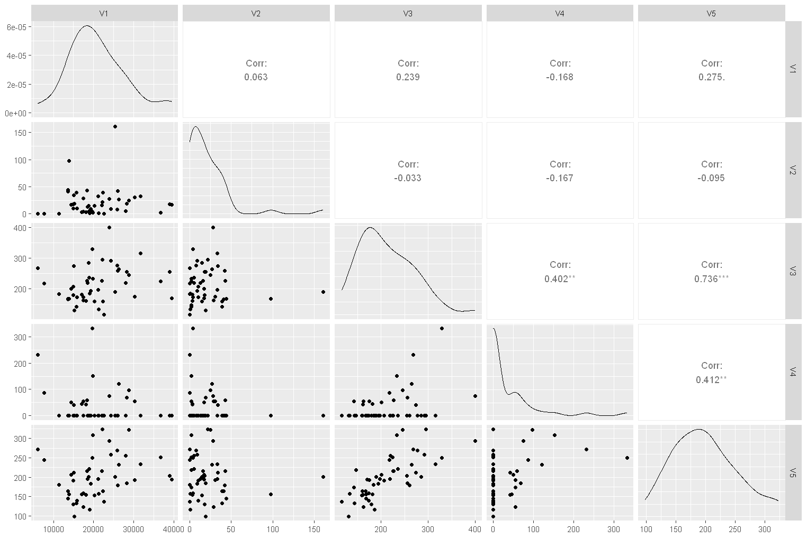
    


```R
data1[, possible_lag := shift(istanbul_first_hand_houses, n = 5)]
data1.2 <- data.table(data1[,possible_lag],data1[,faiz_artırımı],data1[,istanbul_satılık_daire],data1[,istanbul_sıfır_satılık_daire],data1[,sahibinden_istanbul_satılık_daire])
ggpairs(data1.2,cardinality_threshold=NULL)

model1.3 <- lm(possible_lag ~ t + faiz_artırımı + istanbul_satılık_daire + istanbul_sıfır_satılık_daire+ sahibinden_istanbul_satılık_daire , data = data1)
summary(model1.3)
#lag being 5 is not good.
```

    Warning message:
    "Removed 5 rows containing non-finite outside the scale range (`stat_density()`)."
    Warning message in ggally_statistic(data = data, mapping = mapping, na.rm = na.rm, :
    "Removed 5 rows containing missing values"
    Warning message in ggally_statistic(data = data, mapping = mapping, na.rm = na.rm, :
    "Removed 5 rows containing missing values"
    Warning message in ggally_statistic(data = data, mapping = mapping, na.rm = na.rm, :
    "Removed 5 rows containing missing values"
    Warning message in ggally_statistic(data = data, mapping = mapping, na.rm = na.rm, :
    "Removed 5 rows containing missing values"
    Warning message:
    "Removed 5 rows containing missing values or values outside the scale range (`geom_point()`)."
    Warning message:
    "Removed 5 rows containing missing values or values outside the scale range (`geom_point()`)."
    Warning message:
    "Removed 5 rows containing missing values or values outside the scale range (`geom_point()`)."
    Warning message:
    "Removed 5 rows containing missing values or values outside the scale range (`geom_point()`)."
    


    
    Call:
    lm(formula = possible_lag ~ t + faiz_artırımı + istanbul_satılık_daire + 
        istanbul_sıfır_satılık_daire + sahibinden_istanbul_satılık_daire, 
        data = data1)
    
    Residuals:
         Min       1Q   Median       3Q      Max 
    -13825.3  -4194.2   -447.9   3319.5  19628.9 
    
    Coefficients:
                                      Estimate Std. Error t value Pr(>|t|)  
    (Intercept)                       17450.69    6474.44   2.695   0.0105 *
    t                                   -98.17      98.93  -0.992   0.3275  
    faiz_artırımı                        31.14      40.74   0.764   0.4495  
    istanbul_satılık_daire               71.99      32.47   2.217   0.0328 *
    istanbul_sıfır_satılık_daire        -13.30      19.00  -0.700   0.4883  
    sahibinden_istanbul_satılık_daire   -48.43      36.19  -1.338   0.1889  
    ---
    Signif. codes:  0 '***' 0.001 '**' 0.01 '*' 0.05 '.' 0.1 ' ' 1
    
    Residual standard error: 7277 on 37 degrees of freedom
      (5 observations deleted due to missingness)
    Multiple R-squared:  0.1431,	Adjusted R-squared:  0.02727 
    F-statistic: 1.235 on 5 and 37 DF,  p-value: 0.3123
    


    
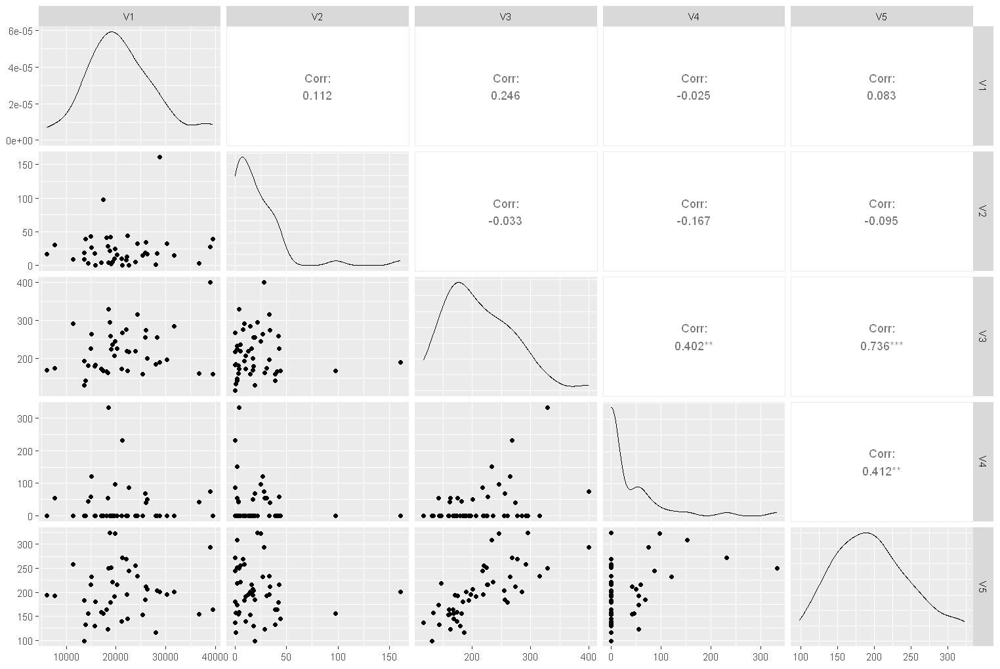
    


THIS IS THE END OF THE FIRST DATA SET WHICH IS SALES OF FIRST HAND HOUSES IN ISTANBUL.


```R
data2 <- data.table()
data2[,'Date':= data[,'Date']]
data2[,'traktor_sales':= data[,'traktor']]

start_month <- "2020-01"
end_month <- "2023-12"

x1 <- fread('C:/Users/DELL/Desktop/HW1/traktör_bayii.csv')
x1[, Month := format(Hafta, "%Y-%m")]
x1 <- x1[, .(Sum = sum(`traktör bayii: (Türkiye)`)), by = Month]
x1 <- x1[Month %between% c(start_month, end_month)]

x2 <- fread('C:/Users/DELL/Desktop/HW1/benzin_fiyatı.csv')
x2[, Month := format(Hafta, "%Y-%m")]
x2 <- x2[, .(Sum = sum(`benzin fiyatı: (Türkiye)`)), by = Month]
x2 <- x2[Month %between% c(start_month, end_month)]

x3 <- fread('C:/Users/DELL/Desktop/HW1/tarım_kredi.csv')
x3[, Month := format(Hafta, "%Y-%m")]
x3 <- x3[, .(Sum = sum(`tarım kredi: (Türkiye)`)), by = Month]
x3 <- x3[Month %between% c(start_month, end_month)]

data2[,'traktör_bayii':= x1[,'Sum']]
data2[,'benzin_fiyatı':= x2[,'Sum']]
data2[,'tarım_kredi':= x3[,'Sum']]
data2$t <- 1:nrow(data)

head(data2)
```


<table class="dataframe">
<caption>A data.table: 6 × 6</caption>
<thead>
	<tr><th scope=col>Date</th><th scope=col>traktor_sales</th><th scope=col>traktör_bayii</th><th scope=col>benzin_fiyatı</th><th scope=col>tarım_kredi</th><th scope=col>t</th></tr>
	<tr><th scope=col>&lt;chr&gt;</th><th scope=col>&lt;dbl&gt;</th><th scope=col>&lt;int&gt;</th><th scope=col>&lt;int&gt;</th><th scope=col>&lt;int&gt;</th><th scope=col>&lt;int&gt;</th></tr>
</thead>
<tbody>
	<tr><td>2020-01</td><td>2515</td><td> 41</td><td> 14</td><td>19</td><td>1</td></tr>
	<tr><td>2020-02</td><td>2750</td><td> 38</td><td> 19</td><td>20</td><td>2</td></tr>
	<tr><td>2020-03</td><td>2188</td><td>176</td><td>123</td><td>37</td><td>3</td></tr>
	<tr><td>2020-04</td><td> 997</td><td> 67</td><td> 27</td><td>26</td><td>4</td></tr>
	<tr><td>2020-05</td><td>1900</td><td>150</td><td> 25</td><td>25</td><td>5</td></tr>
	<tr><td>2020-06</td><td>3172</td><td>248</td><td> 20</td><td>19</td><td>6</td></tr>
</tbody>
</table>


```R
ggplot(data2, aes(x = Date, y=traktor_sales , group =1)) + geom_line(color ="black", linewidth = 1.5) +geom_point()
ggplot(data2 , aes(x = Date, y= traktör_bayii, group =1)) + geom_line(color ="blue", linewidth = 1.5)
ggplot(data2 , aes(x = Date, y= benzin_fiyatı, group =1  )) + geom_line(color ="purple", linewidth = 1.5)
ggplot(data2 , aes(x = Date, y= tarım_kredi, group =1  )) + geom_line(color ="red", linewidth = 1.5)

```


    
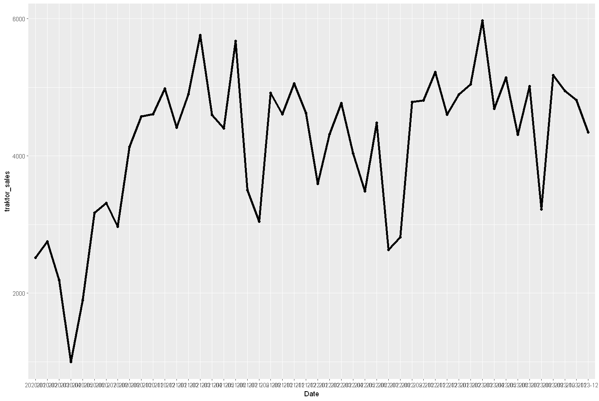
    


    
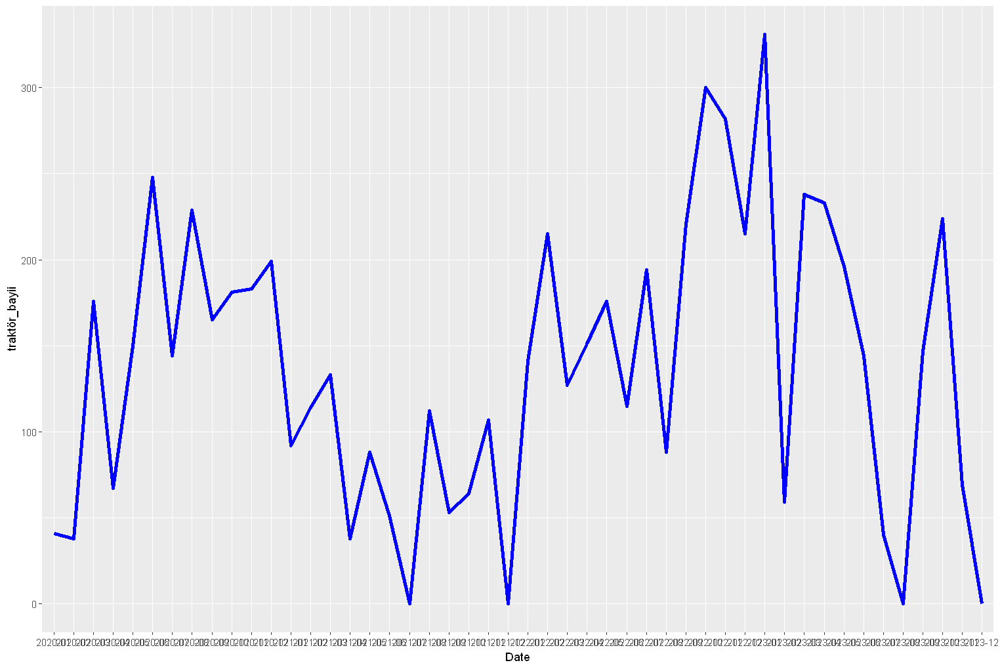
    


    

    


    
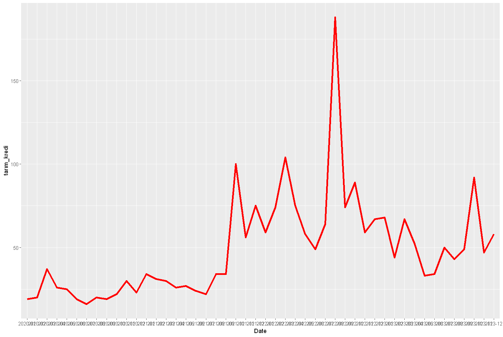
    


```R
require(GGally)
ggpairs(data2,cardinality_threshold=NULL)

```

    `stat_bin()` using `bins = 30`. Pick better value with `binwidth`.
    `stat_bin()` using `bins = 30`. Pick better value with `binwidth`.
    `stat_bin()` using `bins = 30`. Pick better value with `binwidth`.
    `stat_bin()` using `bins = 30`. Pick better value with `binwidth`.
    `stat_bin()` using `bins = 30`. Pick better value with `binwidth`.
    


    
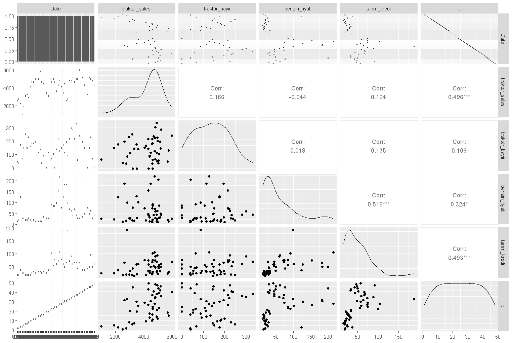
    


```R
acf(data2[,'traktor_sales'])
```


    
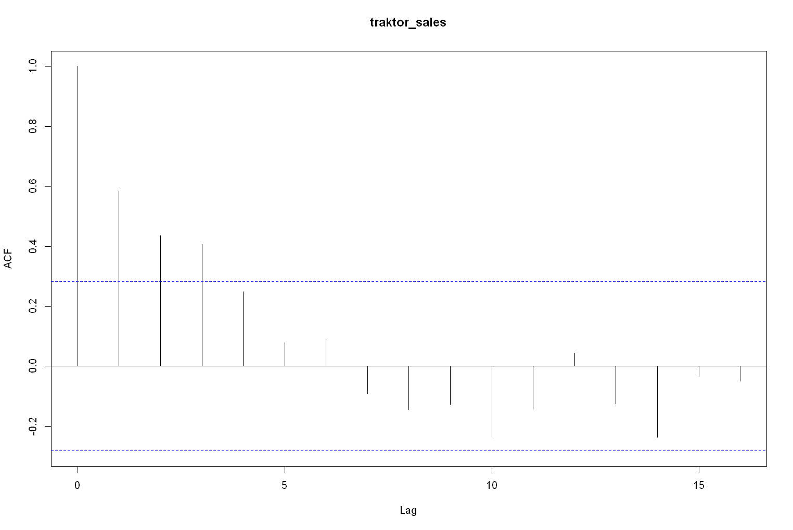
    


```R
model2 <- lm(traktor_sales ~ t + traktör_bayii + benzin_fiyatı+ tarım_kredi, data = data2)
summary(model2)
```


    
    Call:
    lm(formula = traktor_sales ~ t + traktör_bayii + benzin_fiyatı + 
        tarım_kredi, data = data2)
    
    Residuals:
         Min       1Q   Median       3Q      Max 
    -2350.55  -607.33    -2.28   709.12  1786.10 
    
    Coefficients:
                  Estimate Std. Error t value Pr(>|t|)    
    (Intercept)   3244.799    354.342   9.157 1.16e-11 ***
    t               45.007     11.240   4.004 0.000242 ***
    traktör_bayii    1.515      1.646   0.921 0.362388    
    benzin_fiyatı   -3.944      3.009  -1.310 0.197000    
    tarım_kredi     -2.782      5.620  -0.495 0.623156    
    ---
    Signif. codes:  0 '***' 0.001 '**' 0.01 '*' 0.05 '.' 0.1 ' ' 1
    
    Residual standard error: 933.1 on 43 degrees of freedom
    Multiple R-squared:  0.3094,	Adjusted R-squared:  0.2452 
    F-statistic: 4.817 on 4 and 43 DF,  p-value: 0.002671
    


```R
data2[, possible_lag := shift(traktor_sales, n = 5)]
data2.1 <- data.table(data2[,possible_lag],data2[,traktör_bayii],data2[,benzin_fiyatı],data2[,tarım_kredi])
ggpairs(data2.1,cardinality_threshold=NULL)

model2.1 <- lm(possible_lag ~ t + traktör_bayii + benzin_fiyatı + tarım_kredi, data = data2)
summary(model2.1)
```

    Warning message:
    "Removed 5 rows containing non-finite outside the scale range (`stat_density()`)."
    Warning message in ggally_statistic(data = data, mapping = mapping, na.rm = na.rm, :
    "Removed 5 rows containing missing values"
    Warning message in ggally_statistic(data = data, mapping = mapping, na.rm = na.rm, :
    "Removed 5 rows containing missing values"
    Warning message in ggally_statistic(data = data, mapping = mapping, na.rm = na.rm, :
    "Removed 5 rows containing missing values"
    Warning message:
    "Removed 5 rows containing missing values or values outside the scale range (`geom_point()`)."
    Warning message:
    "Removed 5 rows containing missing values or values outside the scale range (`geom_point()`)."
    Warning message:
    "Removed 5 rows containing missing values or values outside the scale range (`geom_point()`)."
    


    
    Call:
    lm(formula = possible_lag ~ t + traktör_bayii + benzin_fiyatı + 
        tarım_kredi, data = data2)
    
    Residuals:
        Min      1Q  Median      3Q     Max 
    -2145.6  -499.1   140.8   499.5  1829.6 
    
    Coefficients:
                   Estimate Std. Error t value Pr(>|t|)    
    (Intercept)   3513.3912   402.1501   8.737 1.27e-10 ***
    t               44.2810    12.0313   3.680  0.00072 ***
    traktör_bayii   -4.9707     1.6060  -3.095  0.00368 ** 
    benzin_fiyatı    0.2862     2.9431   0.097  0.92305    
    tarım_kredi      2.3754     5.2896   0.449  0.65592    
    ---
    Signif. codes:  0 '***' 0.001 '**' 0.01 '*' 0.05 '.' 0.1 ' ' 1
    
    Residual standard error: 875.6 on 38 degrees of freedom
      (5 observations deleted due to missingness)
    Multiple R-squared:  0.4314,	Adjusted R-squared:  0.3715 
    F-statistic: 7.207 on 4 and 38 DF,  p-value: 0.000202
    


    
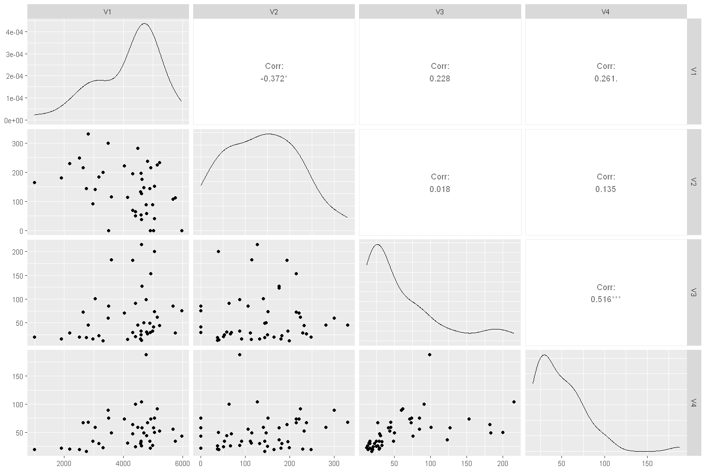
    


```R
tarım_kredi_sqr <- data2$tarım_kredi^2
model2.2 <- lm(possible_lag ~ t + traktör_bayii + benzin_fiyatı + tarım_kredi + tarım_kredi_sqr , data = data2)
summary(model2.2)
```


    
    Call:
    lm(formula = possible_lag ~ t + traktör_bayii + benzin_fiyatı + 
        tarım_kredi + tarım_kredi_sqr, data = data2)
    
    Residuals:
        Min      1Q  Median      3Q     Max 
    -2095.7  -439.2   191.6   508.3  1817.8 
    
    Coefficients:
                      Estimate Std. Error t value Pr(>|t|)    
    (Intercept)     3404.04336  460.51928   7.392 8.58e-09 ***
    t                 40.70303   14.07463   2.892  0.00638 ** 
    traktör_bayii     -5.22643    1.69957  -3.075  0.00394 ** 
    benzin_fiyatı     -0.37910    3.25255  -0.117  0.90784    
    tarım_kredi       10.95995   17.85820   0.614  0.54315    
    tarım_kredi_sqr   -0.04430    0.08794  -0.504  0.61741    
    ---
    Signif. codes:  0 '***' 0.001 '**' 0.01 '*' 0.05 '.' 0.1 ' ' 1
    
    Residual standard error: 884.3 on 37 degrees of freedom
      (5 observations deleted due to missingness)
    Multiple R-squared:  0.4352,	Adjusted R-squared:  0.3589 
    F-statistic: 5.703 on 5 and 37 DF,  p-value: 0.0005366
    


```R
data3 <- data.table()
data3[,'Date':= data[,'Date']]
data3[,'amount_of_reserves':= data[,'total_reserves']]

start_month <- "2020-01"
end_month <- "2023-12"

x1 <- fread('C:/Users/DELL/Desktop/HW1/faiz.csv')
x1[, Month := format(Hafta, "%Y-%m")]
x1 <- x1[, .(Sum = sum(`faiz: (Türkiye)`)), by = Month]
x1 <- x1[Month %between% c(start_month, end_month)]

x2 <- fread('C:/Users/DELL/Desktop/HW1/merkez_bankası_altın_rezervi.csv')
x2[, Month := format(Hafta, "%Y-%m")]
x2 <- x2[, .(Sum = sum(`Merkez Bankası altın rezervi: (Türkiye)`)), by = Month]
x2 <- x2[Month %between% c(start_month, end_month)]

x3 <- fread('C:/Users/DELL/Desktop/HW1/merkez_bankası_döviz_rezervi.csv')
x3[, Month := format(Hafta, "%Y-%m")]
x3 <- x3[, .(Sum = sum(`Merkez Bankası döviz rezervi: (Türkiye)`)), by = Month]
x3 <- x3[Month %between% c(start_month, end_month)]

x4 <- fread('C:/Users/DELL/Desktop/HW1/bist.csv')
x4[, Month := format(Hafta, "%Y-%m")]
x4 <- x4[, .(Sum = sum(`bist: (Türkiye)`)), by = Month]
x4 <- x4[Month %between% c(start_month, end_month)]


data3[,'faiz':= x1[,'Sum']]
data3[,'merkez_bankası_altın_rezervi':= x2[,'Sum']]
data3[,'merkez_bankası_döviz_rezervi':= x3[,'Sum']]
data3[,'bist':= x4[,'Sum']]

data3$t <- 1:nrow(data)

head(data3)
```


<table class="dataframe">
<caption>A data.table: 6 × 7</caption>
<thead>
	<tr><th scope=col>Date</th><th scope=col>amount_of_reserves</th><th scope=col>faiz</th><th scope=col>merkez_bankası_altın_rezervi</th><th scope=col>merkez_bankası_döviz_rezervi</th><th scope=col>bist</th><th scope=col>t</th></tr>
	<tr><th scope=col>&lt;chr&gt;</th><th scope=col>&lt;dbl&gt;</th><th scope=col>&lt;int&gt;</th><th scope=col>&lt;int&gt;</th><th scope=col>&lt;int&gt;</th><th scope=col>&lt;int&gt;</th><th scope=col>&lt;int&gt;</th></tr>
</thead>
<tbody>
	<tr><td>2020-01</td><td>141668.2</td><td>114</td><td> 0</td><td>  0</td><td> 70</td><td>1</td></tr>
	<tr><td>2020-02</td><td>143026.5</td><td> 87</td><td> 0</td><td>  0</td><td> 77</td><td>2</td></tr>
	<tr><td>2020-03</td><td>127037.8</td><td> 93</td><td>19</td><td> 40</td><td>143</td><td>3</td></tr>
	<tr><td>2020-04</td><td>122838.3</td><td> 69</td><td>85</td><td> 68</td><td>101</td><td>4</td></tr>
	<tr><td>2020-05</td><td>127902.3</td><td>127</td><td>31</td><td>102</td><td>108</td><td>5</td></tr>
	<tr><td>2020-06</td><td>126314.8</td><td>104</td><td> 0</td><td> 17</td><td> 91</td><td>6</td></tr>
</tbody>
</table>


```R
ggplot(data3 ,aes(x = Date, y=amount_of_reserves , group =1)) + geom_line(color ="black", linewidth = 1.5) +geom_point()
ggplot(data3 , aes(x = Date, y= faiz, group =1)) + geom_line(color ="blue", linewidth = 1.5)
ggplot(data3 , aes(x = Date, y= merkez_bankası_altın_rezervi, group =1  )) + geom_line(color ="purple", linewidth = 1.5)
ggplot(data3 , aes(x = Date, y= merkez_bankası_döviz_rezervi, group =1  )) + geom_line(color ="red", linewidth = 1.5)
ggplot(data3 , aes(x = Date, y= bist, group =1  )) + geom_line(color ="green", linewidth = 1.5)
```


    
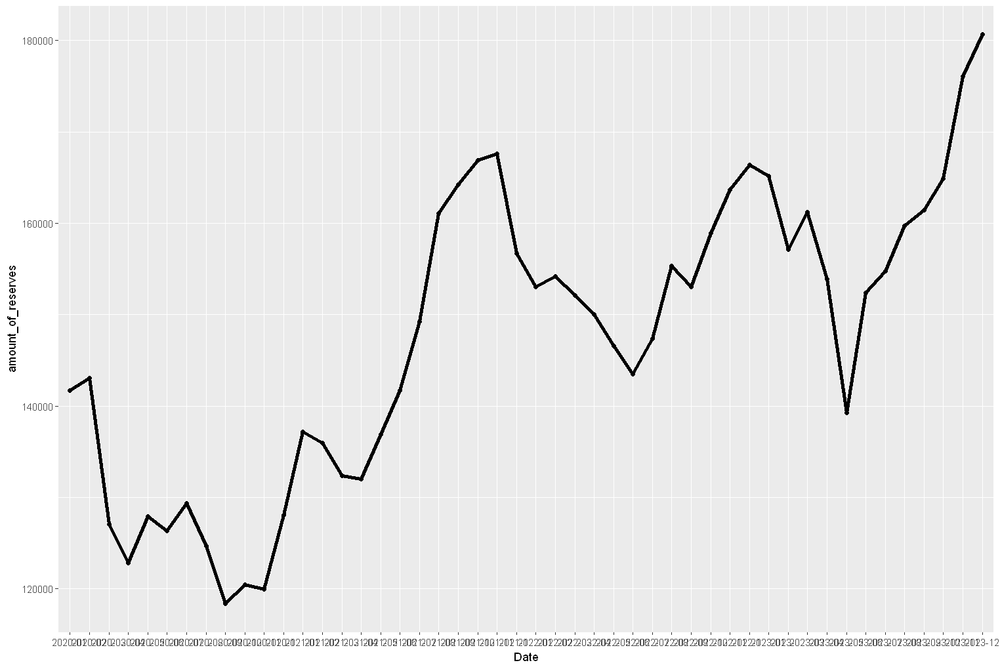
    


    
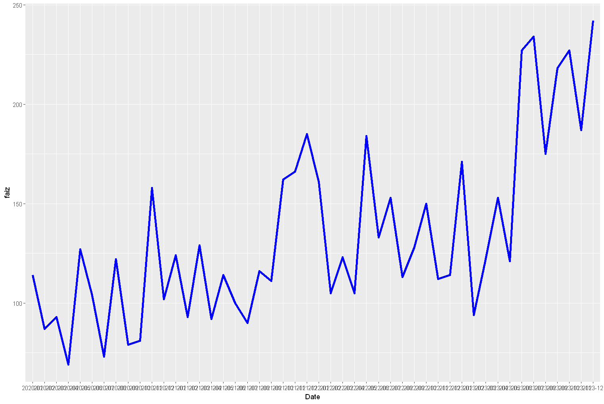
    


    
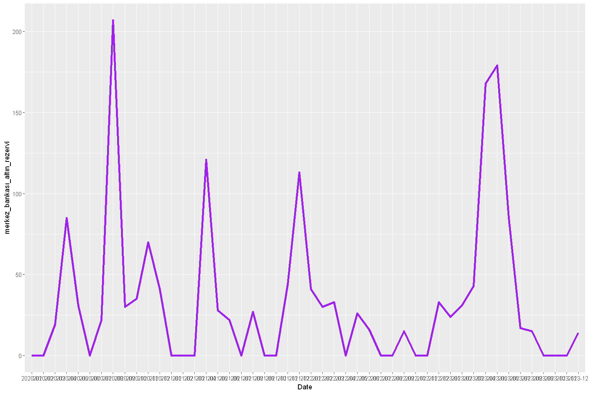
    


    

    


    
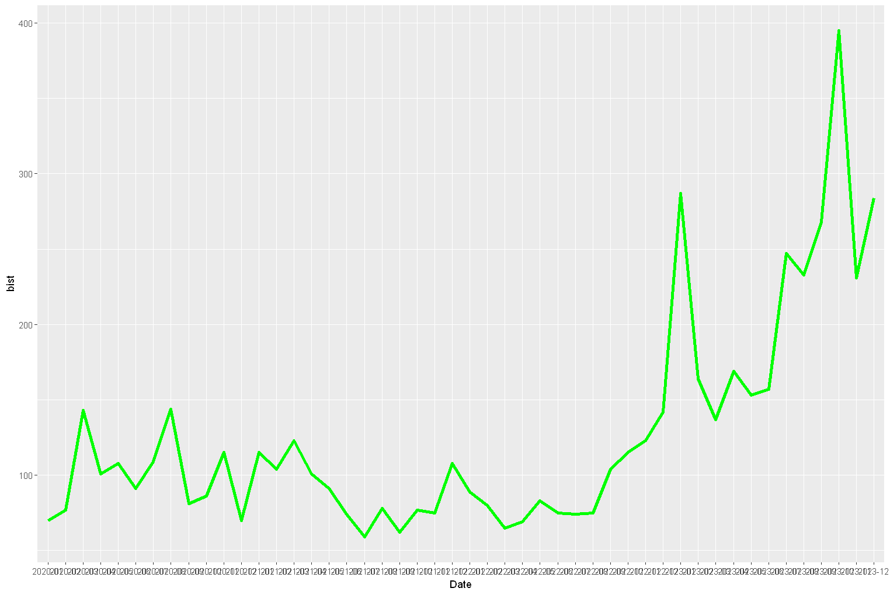
    


```R
require(GGally)
ggpairs(data3,cardinality_threshold=NULL)

```

    `stat_bin()` using `bins = 30`. Pick better value with `binwidth`.
    `stat_bin()` using `bins = 30`. Pick better value with `binwidth`.
    `stat_bin()` using `bins = 30`. Pick better value with `binwidth`.
    `stat_bin()` using `bins = 30`. Pick better value with `binwidth`.
    `stat_bin()` using `bins = 30`. Pick better value with `binwidth`.
    `stat_bin()` using `bins = 30`. Pick better value with `binwidth`.
    


    
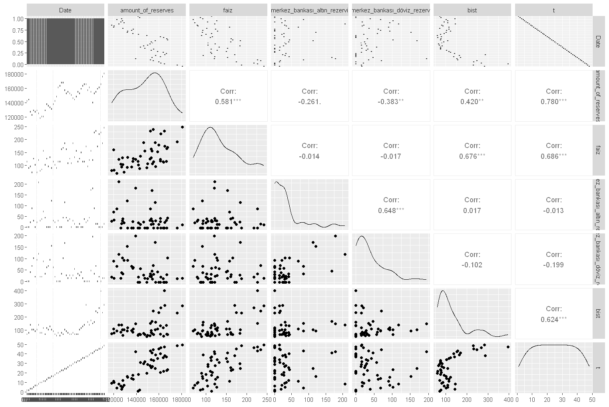
    


```R
acf(data3[,'amount_of_reserves'])
```


    
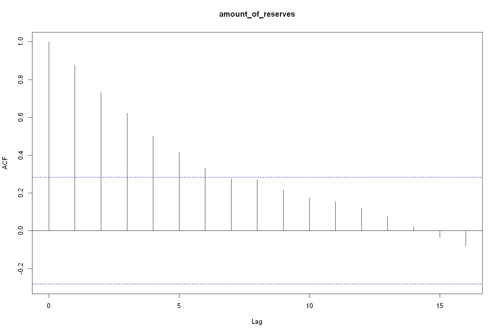
    


```R
model3 <- lm(amount_of_reserves ~ t + faiz + merkez_bankası_altın_rezervi + merkez_bankası_döviz_rezervi + bist, data = data3)
summary(model3)
```


    
    Call:
    lm(formula = amount_of_reserves ~ t + faiz + merkez_bankası_altın_rezervi + 
        merkez_bankası_döviz_rezervi + bist, data = data3)
    
    Residuals:
         Min       1Q   Median       3Q      Max 
    -15670.0  -5854.9   -200.5   4702.5  20577.3 
    
    Coefficients:
                                  Estimate Std. Error t value Pr(>|t|)    
    (Intercept)                  126676.30    4459.05  28.409  < 2e-16 ***
    t                               816.08     144.52   5.647 1.28e-06 ***
    faiz                             74.89      47.26   1.584    0.121    
    merkez_bankası_altın_rezervi    -45.08      37.24  -1.210    0.233    
    merkez_bankası_döviz_rezervi    -56.89      40.25  -1.413    0.165    
    bist                            -40.80      26.69  -1.529    0.134    
    ---
    Signif. codes:  0 '***' 0.001 '**' 0.01 '*' 0.05 '.' 0.1 ' ' 1
    
    Residual standard error: 9204 on 42 degrees of freedom
    Multiple R-squared:  0.7029,	Adjusted R-squared:  0.6675 
    F-statistic: 19.87 on 5 and 42 DF,  p-value: 4.082e-10
    


```R
"""data3[, possible_lag := shift(amount_of_reserves, n = 6)]
data3.1 <- data.table(data3[,possible_lag],data3[,faiz],data3[,merkez_bankası_altın_rezervi],data3[,merkez_bankası_döviz_rezervi],data3[,bist])
ggpairs(data3.1,cardinality_threshold=NULL)

#model3.1 <- lm(possible_lag ~ t + faiz + merkez_bankası_altın_rezervi + merkez_bankası_döviz_rezervi + bist, data = data3)
#summary(model3.1)"""
```

    Warning message:
    "Removed 6 rows containing non-finite outside the scale range (`stat_density()`)."
    Warning message in ggally_statistic(data = data, mapping = mapping, na.rm = na.rm, :
    "Removed 6 rows containing missing values"
    Warning message in ggally_statistic(data = data, mapping = mapping, na.rm = na.rm, :
    "Removed 6 rows containing missing values"
    Warning message in ggally_statistic(data = data, mapping = mapping, na.rm = na.rm, :
    "Removed 6 rows containing missing values"
    Warning message in ggally_statistic(data = data, mapping = mapping, na.rm = na.rm, :
    "Removed 6 rows containing missing values"
    Warning message:
    "Removed 6 rows containing missing values or values outside the scale range (`geom_point()`)."
    Warning message:
    "Removed 6 rows containing missing values or values outside the scale range (`geom_point()`)."
    Warning message:
    "Removed 6 rows containing missing values or values outside the scale range (`geom_point()`)."
    Warning message:
    "Removed 6 rows containing missing values or values outside the scale range (`geom_point()`)."
    


    
    Call:
    lm(formula = possible_lag ~ t + faiz + merkez_bankası_altın_rezervi + 
        merkez_bankası_döviz_rezervi + bist, data = data3)
    
    Residuals:
         Min       1Q   Median       3Q      Max 
    -19493.0  -5813.6   -266.9   3663.0  22546.4 
    
    Coefficients:
                                  Estimate Std. Error t value Pr(>|t|)    
    (Intercept)                  118517.59    5465.51  21.685  < 2e-16 ***
    t                              1046.72     196.54   5.326 5.54e-06 ***
    faiz                             44.70      52.58   0.850   0.4009    
    merkez_bankası_altın_rezervi     69.35      40.98   1.692   0.0992 .  
    merkez_bankası_döviz_rezervi    -38.71      46.14  -0.839   0.4071    
    bist                            -72.59      30.59  -2.373   0.0231 *  
    ---
    Signif. codes:  0 '***' 0.001 '**' 0.01 '*' 0.05 '.' 0.1 ' ' 1
    
    Residual standard error: 9909 on 36 degrees of freedom
      (6 observations deleted due to missingness)
    Multiple R-squared:  0.6103,	Adjusted R-squared:  0.5561 
    F-statistic: 11.27 on 5 and 36 DF,  p-value: 1.371e-06
    


    
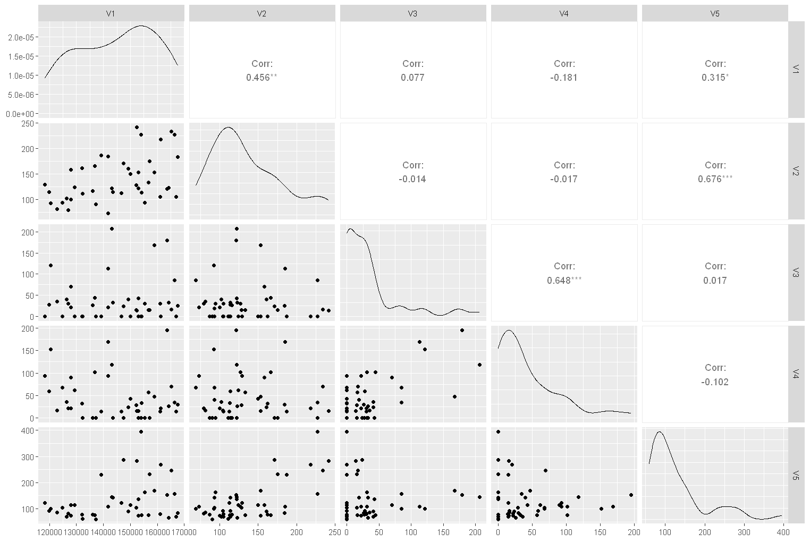
    


```R
"""bist_sqr <- data3$bist^2
faiz_sqr <- data3$faiz^2

model3.3 <- lm(possible_lag ~ t + faiz + merkez_bankası_altın_rezervi + bist + bist_sqr + faiz_sqr, , data = data3)
summary(model3.3)"""
```


    
    Call:
    lm(formula = possible_lag ~ t + faiz + merkez_bankası_altın_rezervi + 
        bist + bist_sqr + faiz_sqr, data = data3)
    
    Residuals:
       Min     1Q Median     3Q    Max 
    -18376  -6198  -1065   5331  19746 
    
    Coefficients:
                                   Estimate Std. Error t value Pr(>|t|)    
    (Intercept)                   1.413e+05  1.848e+04   7.644 5.75e-09 ***
    t                             1.200e+03  1.934e+02   6.204 4.17e-07 ***
    faiz                         -2.212e+02  2.489e+02  -0.889   0.3801    
    merkez_bankası_altın_rezervi  6.660e+01  3.356e+01   1.985   0.0551 .  
    bist                         -1.887e+02  1.003e+02  -1.882   0.0682 .  
    bist_sqr                      2.583e-01  2.391e-01   1.080   0.2874    
    faiz_sqr                      8.321e-01  8.114e-01   1.026   0.3121    
    ---
    Signif. codes:  0 '***' 0.001 '**' 0.01 '*' 0.05 '.' 0.1 ' ' 1
    
    Residual standard error: 9821 on 35 degrees of freedom
      (6 observations deleted due to missingness)
    Multiple R-squared:  0.6278,	Adjusted R-squared:  0.564 
    F-statistic:  9.84 on 6 and 35 DF,  p-value: 2.333e-06
    


```R

```
